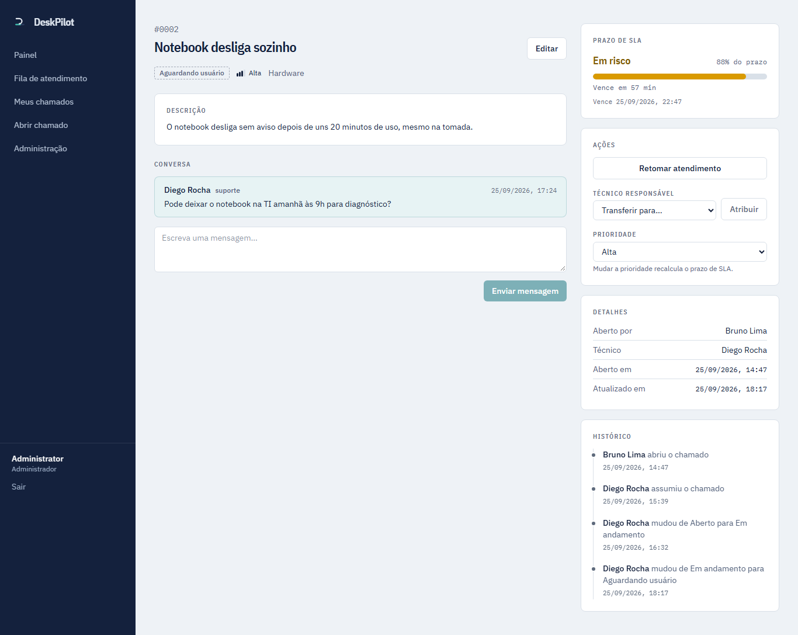
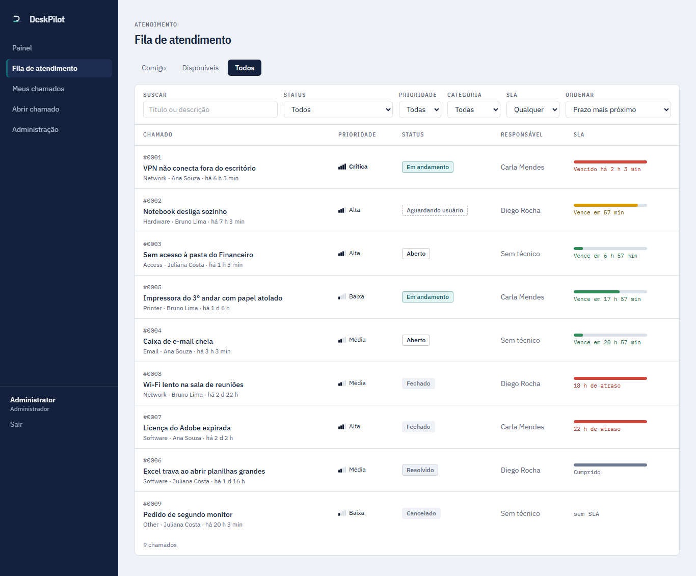
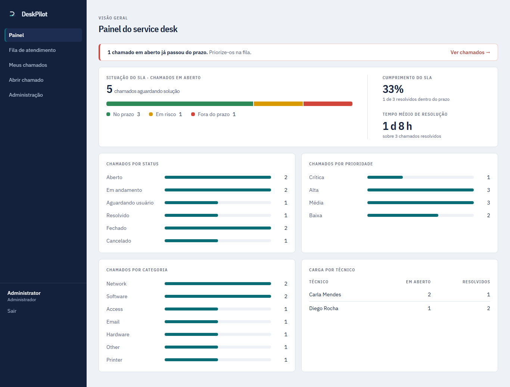
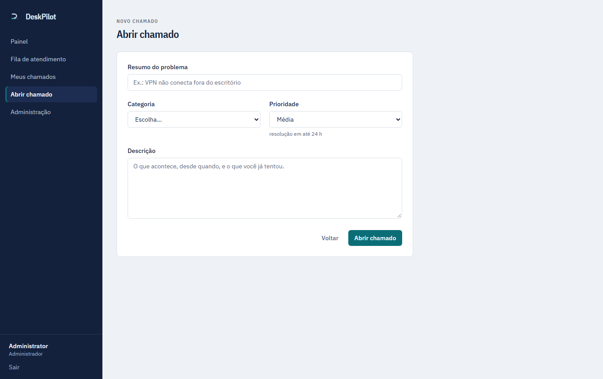
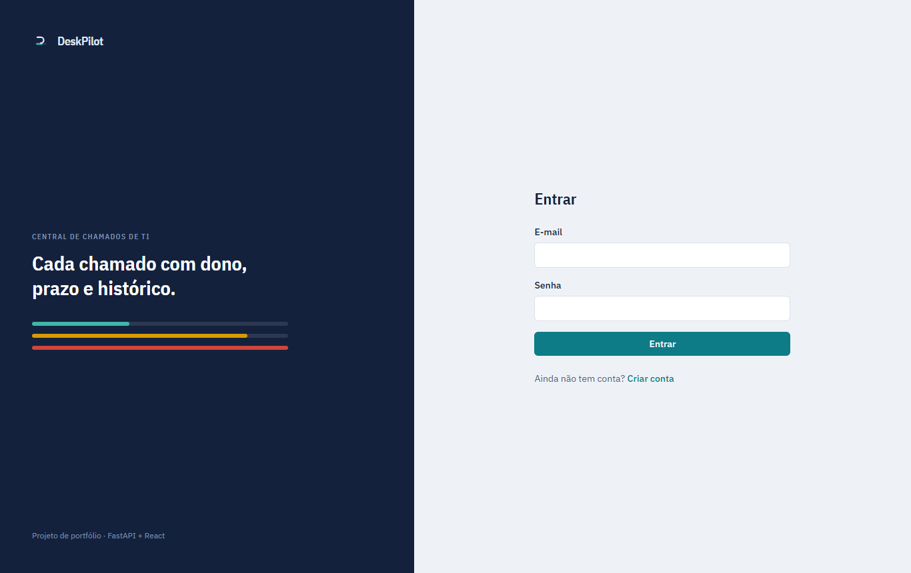
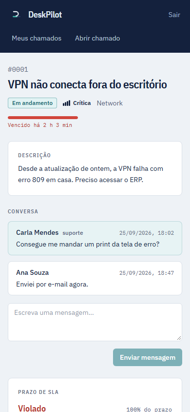

# DeskPilot

[](https://github.com/cidoliveira/deskpilot/actions/workflows/ci.yml)

> Sistema de **Help Desk / Service Desk** para gestão de chamados internos de TI.
> API REST em FastAPI + PostgreSQL e interface em React + TypeScript.

🇺🇸 *An IT Help Desk / Service Desk web app for internal tickets: FastAPI REST API with
role-based access, auditable ticket history, SLA tracking and a React frontend.*



---

## O problema

Em muitas empresas, pedidos de suporte chegam por e-mail, chat e corredor. Nada fica registrado,
ninguém sabe quem está cuidando do quê e não há como medir tempo de atendimento.
O DeskPilot centraliza os chamados em um fluxo único e auditável:

- o **usuário** abre e acompanha seus chamados;
- o **técnico** assume, trabalha e resolve;
- o **administrador** distribui a fila, gerencia usuários e categorias e acompanha métricas e SLA.

## Funcionalidades

| Status | Funcionalidade |
|---|---|
| ✅ | Estrutura da API, Docker Compose, PostgreSQL, migrations (Alembic), tratamento de erros padronizado |
| ✅ | Autenticação JWT, senhas com Argon2 e controle de acesso por role (USER, TECHNICIAN, ADMIN) |
| ✅ | Gestão de usuários pelo administrador, com paginação e filtros |
| ✅ | Categorias gerenciáveis pelo admin (7 categorias padrão criadas por migration) |
| ✅ | Abertura, listagem paginada, detalhe e edição de tickets com visibilidade por role |
| ✅ | Máquina de estados de status, atribuição (com trava de concorrência), prioridade |
| ✅ | Histórico auditável de todas as mudanças, gravado na mesma transação |
| ✅ | `allowed_actions`: a API informa ao frontend o que o usuário pode fazer em cada ticket |
| ✅ | Comentários, bloqueados em tickets encerrados; a resposta do autor retoma um ticket em WAITING_USER |
| ✅ | SLA por prioridade (no prazo, em risco, violado, cumprido) |
| ✅ | Filtros (status, prioridade, categoria, técnico, autor, SLA, período), busca textual e ordenação |
| ✅ | Dashboard de métricas: volume, SLA, tempo médio de resolução e carga por técnico |
| ✅ | CI no GitHub Actions: lint, validação de migrations e testes com cobertura mínima de 90% |
| ✅ | Interface React em PT-BR: fila do técnico, detalhe com ações por perfil, painel e administração |
| ✅ | Dados de demonstração criados pelo fluxo real (script de seed) |
| ✅ | Limite de tentativas de login (429 + `Retry-After`) por IP e e-mail |
| ✅ | Acessibilidade verificada: contraste AA, navegação por teclado, axe nos testes e2e |
| ✅ | Pilha de produção: imagens `prod`, Nginx com headers de segurança, migrations em etapa separada |

## Arquitetura

```
backend/
├── app/
│   ├── main.py          # criação da aplicação
│   ├── api/             # rotas HTTP (finas) e dependências
│   ├── core/            # configuração, segurança, exceções
│   ├── db/              # engine, sessão, base declarativa
│   ├── models/          # modelos SQLAlchemy
│   ├── schemas/         # schemas Pydantic (entrada/saída)
│   └── services/        # regras de negócio
├── alembic/             # migrations
└── tests/

frontend/src/
├── auth/                # sessão (token + usuário atual via /auth/me)
├── services/            # cliente HTTP tipado e contrato de erros da API
├── hooks/               # queries e mutations (TanStack Query)
├── routes/              # rotas e guardas por perfil
├── components/          # SLA gauge, tabela, filtros, ações do ticket...
├── pages/               # telas
└── lib/                 # rótulos PT-BR, formatação, SLA
```

As regras de negócio ficam na camada de **services**, que não conhece HTTP: ela lança exceções
de domínio, convertidas em respostas padronizadas por handlers centrais.
Modelo de domínio, regras e decisões técnicas estão em **[docs/arquitetura.md](docs/arquitetura.md)**.

O frontend **não duplica regras de negócio**: cada ticket vem da API com `allowed_actions`
(o que o usuário atual pode fazer), e a tela só desenha esses botões. A API continua validando
tudo, então forçar uma URL ou uma requisição não burla nenhuma regra.

## Tecnologias

- **Backend:** Python 3.13, FastAPI, SQLAlchemy 2, Alembic, Pydantic v2, PostgreSQL 17
- **Testes:** Pytest, HTTPX (TestClient), banco PostgreSQL real e isolado
- **Qualidade:** Ruff (lint + format)
- **Infra:** Docker, Docker Compose, uv (gerenciador de pacotes)
- **Frontend:** React 19, TypeScript (strict), Vite, Tailwind CSS 4, React Router, TanStack Query
- **Testes do frontend:** Vitest + Testing Library; Playwright (e2e) + axe (acessibilidade); oxlint e Prettier
- **CI:** GitHub Actions com 4 jobs: backend, frontend, e2e contra API e banco reais, e a pilha de produção em Docker

## Como executar

Pré-requisitos: Docker e Docker Compose.

```bash
cp .env.example .env        # ajuste POSTGRES_PASSWORD
docker compose up --build
```

- API: http://localhost:8000/api/v1/health
- Swagger (OpenAPI): http://localhost:8000/api/v1/docs
- ReDoc: http://localhost:8000/api/v1/redoc

Ao subir, o container da API aplica as migrations e cria o admin inicial definido em
`FIRST_ADMIN_EMAIL` / `FIRST_ADMIN_PASSWORD` (se ainda não existir).

### Frontend

```bash
cd frontend
npm install
npm run dev        # http://localhost:5173 (o Vite encaminha /api para localhost:8000)
```

### Em modo produção

```bash
cp .env.example .env    # troque todos os segredos
docker compose -f docker-compose.prod.yml up -d --build
# http://localhost:8080
```

Nginx serve o React e encaminha `/api` para a API (mesma origem, sem CORS); as migrations
rodam num serviço próprio antes da API subir; só o Nginx é publicado. O passo a passo para
colocar em um servidor (HTTPS, backup, atualização) está em **[docs/deploy.md](docs/deploy.md)**.

### Dados de demonstração

```bash
docker compose exec api python -m app.scripts.seed_demo
```

Cria dois técnicos, três usuários e nove chamados em todos os status e estados de SLA, passando
pelos serviços reais (o histórico é verdadeiro). As contas usam a senha definida em
`DEMO_PASSWORD`: `carla@deskpilot.dev` e `diego@deskpilot.dev` (técnicos),
`ana@deskpilot.dev`, `bruno@deskpilot.dev` e `juliana@deskpilot.dev` (usuários).
O script não roda com `ENVIRONMENT=production`.

### Autenticação

1. Crie uma conta em `POST /api/v1/auth/register` (sempre com role `USER`)
   ou entre com o admin inicial.
2. Faça login em `POST /api/v1/auth/login` (form OAuth2: `username` = e-mail, `password`).
3. Envie o token no header `Authorization: Bearer <token>`.

No Swagger, o botão **Authorize** faz o login direto pela interface.
Técnicos e administradores são criados por um admin em `POST /api/v1/users`.

### Configuração (.env)

| Variável | Descrição | Padrão |
|---|---|---|
| `ENVIRONMENT` | `development`, `test` ou `production` | `development` |
| `LOG_LEVEL` | Nível de log | `INFO` |
| `API_PORT` | Porta da API no host | `8000` |
| `POSTGRES_HOST` | Host do banco (`db` dentro do Compose) | `localhost` |
| `POSTGRES_PORT` | Porta do banco | `5432` |
| `POSTGRES_USER` / `POSTGRES_PASSWORD` | Credenciais do banco | — (obrigatórias) |
| `POSTGRES_DB` | Banco da aplicação | `deskpilot` |
| `POSTGRES_TEST_DB` | Banco usado pelos testes (precisa terminar em `_test`) | `deskpilot_test` |
| `JWT_SECRET_KEY` | Chave de assinatura dos tokens (mínimo 32 caracteres) | — (obrigatória) |
| `JWT_ALGORITHM` | Algoritmo do JWT | `HS256` |
| `ACCESS_TOKEN_EXPIRE_MINUTES` | Validade do token | `60` |
| `FIRST_ADMIN_EMAIL` / `FIRST_ADMIN_PASSWORD` | Admin criado no startup, se ainda não existir | opcional |
| `FIRST_ADMIN_NAME` | Nome do admin inicial | `Administrator` |
| `DEMO_PASSWORD` | Senha das contas de demonstração (`seed_demo`) | opcional |
| `LOGIN_MAX_FAILURES` / `LOGIN_WINDOW_MINUTES` | Falhas de login permitidas por IP + e-mail na janela | `5` / `15` |
| `CORS_ORIGINS` | Origens permitidas quando o frontend fica em outro domínio | vazio |

O arquivo `.env` nunca é versionado; apenas `.env.example`.

## Migrations

```bash
# criar uma migration a partir dos modelos
docker compose exec api alembic revision --autogenerate -m "descricao"

# aplicar / reverter
docker compose exec api alembic upgrade head
docker compose exec api alembic downgrade -1

# verificar se os modelos estão sincronizados com as migrations
docker compose exec api alembic check
```

## Testes

| Camada | Testes | Cobertura |
|---|---|---|
| Backend (Pytest, PostgreSQL real) | ~300 | 98% |
| Frontend (Vitest + Testing Library, telas inteiras com API simulada) | 81 | 93% |
| End-to-end (Playwright: navegador → API → banco) | 9 fluxos | — |

O CI falha abaixo de 90% no backend e 80% no frontend. Os testes não cobrem só o caminho feliz;
testam as regras de negócio, por exemplo:

- usuário não enxerga ticket de outro usuário (404) e filtros nunca ampliam a visibilidade;
- transições de status inválidas (409), ator errado (403), resolução sem texto ou sem técnico (422);
- ticket fechado não aceita comentários nem edição;
- toda atribuição, mudança de status e de prioridade gera evento no histórico;
- dois técnicos assumindo o mesmo ticket ao mesmo tempo (duas transações reais);
- a regra de SLA em SQL (filtros e dashboard) concorda com a regra em Python (respostas);
- constraints do banco rejeitam dados inválidos mesmo inseridos por SQL direto;
- **e2e:** um chamado vai de aberto a fechado passando por usuário e técnico, com cada passo
  no histórico; outro usuário não abre o chamado pelo link; telas de admin não são alcançáveis;
- **acessibilidade:** nove telas passam no axe (WCAG 2.1 A/AA), o link "Pular para o conteúdo"
  funciona pelo teclado e nenhuma tela transborda num celular de 390 px;
- **segurança:** um `X-Forwarded-For` forjado não dá tentativas extras de login (testado na
  pilha de produção, através do Nginx).

Os testes de tela já encontraram bugs reais que foram corrigidos: o retorno à página pedida
depois do login não funcionava, e editar um chamado podia trocar a categoria sozinho.

Os testes usam um banco PostgreSQL separado (`POSTGRES_TEST_DB`), criado automaticamente.
O schema é montado **rodando as migrations**, o que também as valida, e cada teste roda em
uma transação desfeita ao final.

```bash
# backend, dentro do Docker
docker compose exec api pytest

# ou localmente (com o banco do Compose rodando)
cd backend
uv sync
uv run pytest --cov

# frontend
cd frontend
npm test                 # ou npm run test:coverage

# end-to-end (API rodando em localhost:8000)
npx playwright install chromium   # na primeira vez
npm run test:e2e
```

## Exemplos de uso

```bash
# chamados do técnico logado, em andamento, mais urgentes primeiro
GET /api/v1/tickets?assignee=me&status=IN_PROGRESS&sort=-priority

# chamados abertos fora do SLA
GET /api/v1/tickets?sla_status=BREACHED&status=OPEN&status=IN_PROGRESS

# busca textual em março
GET /api/v1/tickets?q=vpn&created_from=2026-03-01&created_to=2026-03-31
```

## Documentação da API

Gerada automaticamente pelo FastAPI (OpenAPI 3) em `/api/v1/docs`.
Todos os erros seguem o mesmo formato:

```json
{ "error": "invalid_status_transition", "message": "Cannot move ticket from CLOSED to IN_PROGRESS" }
```

## Screenshots

| | |
|---|---|
| **Fila de atendimento**: o prazo de SLA de cada chamado numa barra | **Painel do admin**: o que precisa de ação primeiro |
|  |  |
| **Abrir chamado**: a prioridade mostra o prazo que ela significa | **Login** |
|  |  |

<p align="center"></p>

## Roadmap

- [x] **Etapa 1:** FastAPI, Docker, PostgreSQL, SQLAlchemy, Alembic, tratamento de erros
- [x] **Etapa 2:** usuários, autenticação JWT, roles
- [x] **Etapa 3:** categorias e tickets (visibilidade por role, paginação)
- [x] **Etapa 4:** workflow (atribuição, status, prioridade) e histórico
- [x] **Etapa 5:** comentários
- [x] **Etapa 6:** SLA, filtros, busca e ordenação
- [x] **Etapa 7:** dashboard de métricas e CI (GitHub Actions)
- [x] **Etapa 8:** frontend React
- [x] **Etapa 9:** pilha de produção (Docker + Nginx) testada no CI e guia de deploy

### Próximos passos

- Publicar numa VPS seguindo o [guia de deploy](docs/deploy.md)
- Comentários internos (visíveis só para a equipe) e anexos
- Notificações por e-mail quando o chamado muda ou o SLA entra em risco
- SLA em horário comercial, com pausa enquanto aguarda o usuário
- Login via SSO (Entra ID / Google Workspace)
